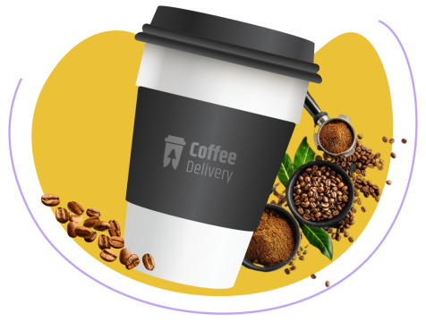

<div align="center">
  
</div>

#### [Access Coffee Delivery](https://coffee-delivery-mg.vercel.app/)

### :hammer: About the application

This is a challenge proposed by Rocketseat on the ReactJs track, we received the design through figma and from the layout we created this application for an e-commerce, coffee delivery.

</br>
</br>
<div align="center">
  
</div>
</br>
</br>

### :rocket: Technologies

- ReactJS
- Vite
- Styled-Components
- TypeScript
- JavaScript
- Figma
- Phosphor Icons

### :arrow_heading_down: How to install the project and run

```bash
  # clone the project
  git clone https://github.com/mauriciogirardi/Coffee-delivery.git
  # Open the project
  cd coffee-delivery
  # Install
  yarn || npm i
```

### :paintbrush: Layout

[figma](<https://www.figma.com/file/SVUGdyBwax2hQfav02cB8J/Coffee-Delivery-(Copy)?node-id=2%3A1550>)

---

Feito com :heart: by [Mauricio Girardi](https://www.linkedin.com/in/mauricio-girardi)
